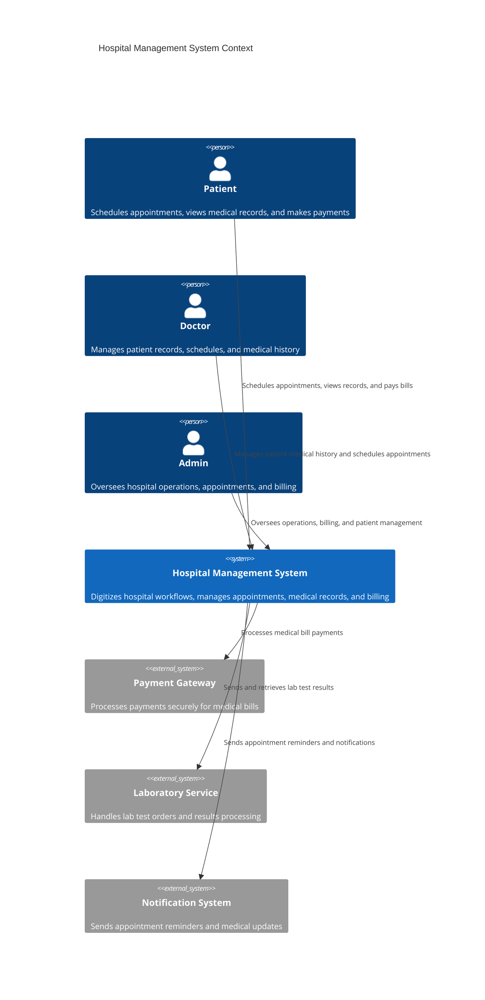
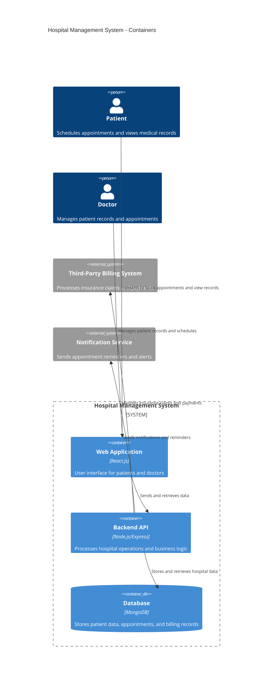
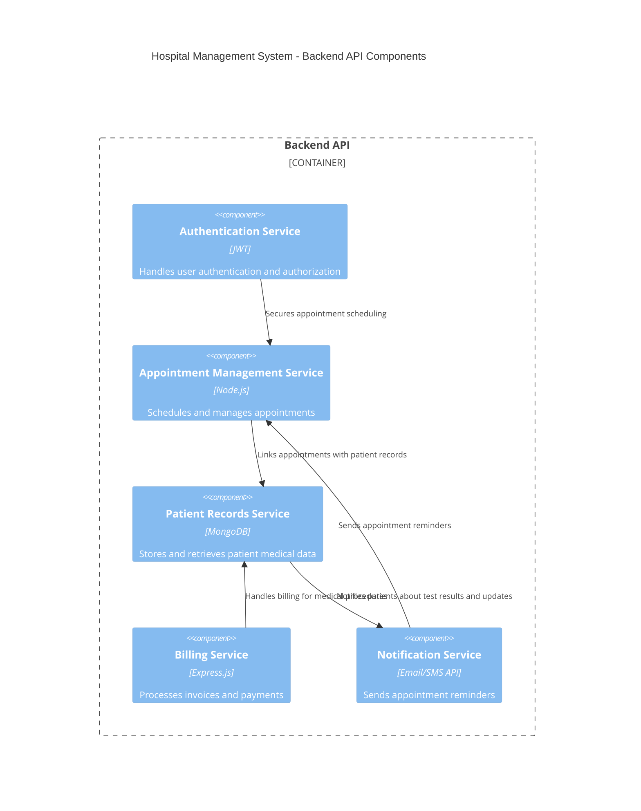

# Hospital Management System - Architecture

## 1. Project Title
**Hospital Management System**

## 2. Domain
**Healthcare Industry**

### 2.1 Description
The Hospital Management System streamlines hospital operations such as patient registration, doctor appointments, medical record management, billing, and reporting. The system will be cloud-based, ensuring scalability and security.

## 3. Problem Statement

Manual management of hospital data often results in inefficiencies, errors, and delays. The system aims to:
- Improve appointment scheduling.
- Ensure secure and efficient handling of patient records.
- Automate billing to prevent financial discrepancies.

## 4. Scope & Feasibility

### 4.1 Technology Stack
- **Frontend**: React.js
- **Backend**: Node.js with Express.js
- **Database**: MongoDB
- **Security**: JWT for authentication
- **Deployment**: Cloud-based (AWS/Firebase)
- **Payment Gateway**: Integrated for secure payment processing

### 4.2 C4 Diagrams

#### **C4 Context: Hospital Management System Context**

