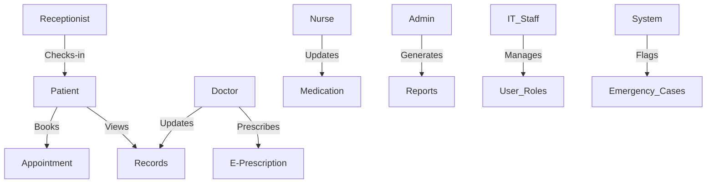

# Assignment 5: Use Case Modeling and Test Case Development

## Objective
This document translates stakeholder and system requirements from Assignment 4 into **use case diagrams**, **detailed use case specifications**, and **test cases** to validate system behavior.

---

## 1. Use Case Diagram

### **Diagram Overview**
- The Use Case Diagram represents interactions between users (actors) and the **Hospital Management System**.
- **Key actors:** Patients, Doctors, Nurses, Receptionists, IT Staff, Hospital Administrators.
- **Key use cases:** Book Appointment, Access Patient Records, Update Medication, Check-In Patient, Generate Reports, etc.
- **Relationships:**
  - *Generalization*: Doctors and Nurses inherit access to patient records.
  - *Inclusion*: "Check Availability" is included in "Book Appointment."

### **Explanation**
- The diagram ensures alignment with the **functional requirements** in Assignment 4.
- Example: *The patient can initiate the "Book Appointment" use case, which includes "Check Availability," ensuring reduced booking conflicts.*

---

## 2. Use Case Specifications

### **Selected Use Cases**
| Use Case | Actor | Description |
|----------|-------|-------------|
| Book Appointment | Patient | Allows patients to schedule appointments. |
| Access Patient Records | Doctor | Enables doctors to retrieve patient records. |
| Update Medication | Nurse | Nurses can update patient medication schedules. |
| Check-In Patient | Receptionist | Handles patient check-in and verification. |
| Generate Reports | Administrator | Generates hospital analytics reports. |
| Manage User Roles | IT Staff | Controls access rights for different user roles. |
| Emergency Case Flagging | System | Automatically prioritizes urgent medical cases. |
| E-Prescribe Medication | Doctor | Doctors can prescribe medicine electronically. |

### **Example: Use Case Specification for Book Appointment**

**Use Case:** Book Appointment  
**Actor:** Patient  
**Precondition:** Patient is logged into the system.  
**Postcondition:** Appointment is confirmed and recorded in the system.  

**Basic Flow:**
1. Patient selects "Book Appointment" option.
2. System prompts patient to select doctor and available time slot.
3. System checks availability and confirms booking.
4. System sends confirmation to the patient.

**Alternative Flows:**
- If no slots are available, the system suggests alternative times.
- If the patient does not complete booking, the session times out.

---

## 3. Test Case Development

### **Functional Test Cases**
| Test Case ID | Requirement ID | Description | Steps | Expected Result | Actual Result | Status (Pass/Fail) |
|-------------|---------------|-------------|-------|-----------------|--------------|-----------------|
| TC001 | FR-001 | Patient books an appointment | 1. Log in 2. Select doctor 3. Choose time slot 4. Confirm | Appointment booked successfully | | |
| TC002 | FR-002 | Doctor accesses patient records | 1. Log in 2. Select patient record | Record displayed | | |
| TC003 | FR-003 | Receptionist checks in patient | 1. Enter patient ID 2. Confirm check-in | Patient marked as checked-in | | |

### **Non-Functional Test Cases**
| Test Case ID | Requirement ID | Description | Steps | Expected Result | Actual Result | Status (Pass/Fail) |
|-------------|---------------|-------------|-------|-----------------|--------------|-----------------|
| NTC001 | NF-005 | Performance: Handle 1000 users | Simulate 1000 users searching for appointments | System responds within 2 seconds | | |
| NTC002 | NF-006 | Security: Ensure AES-256 encryption | Attempt unauthorized data access | System denies access | | |
